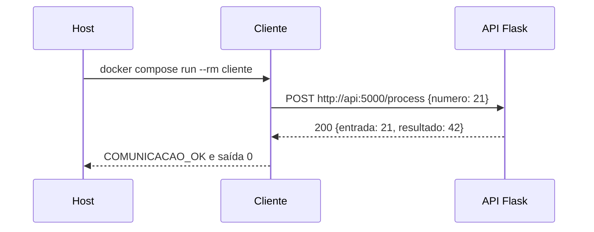
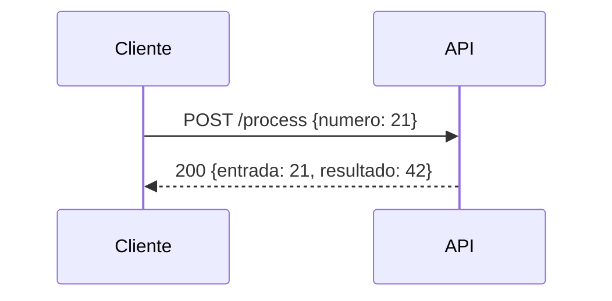

# Guia de consulta — ponderada de Docker e Compose

**Objetivo:** construir imagens, executar serviços em contêineres separados, comprovar a comunicação entre eles e explicar as decisões no README. Este guia serve como roteiro de resolução e como exemplo copiável. Adapte nomes, portas, arquivos e lógica ao enunciado recebido.

**Como usar este arquivo:** faça as etapas **1.1 → 2 → 2.1 → 3 → 7 → 8** uma vez antes da ponderada. Durante a atividade, comece pela seção **1** para interpretar o enunciado; procure a seção **6** se algo falhar. As seções **9–12** cobrem variações, Windows, revisão conceitual e publicação no seu repositório.

## 1. O mapa mental da atividade

Quando receber o enunciado, responda nesta ordem:

1. **Quais são os processos independentes?** Ex.: uma API que recebe dados e outro programa que a consulta. Cada processo principal vira um serviço no Compose.
2. **Quem inicia a comunicação?** Identifique origem, destino, protocolo, rota e porta. Ex.: `cliente → HTTP POST → api:5000/process`.
3. **O que cada imagem precisa?** Linguagem/base, dependências, código, diretório de trabalho e comando inicial. Isso define cada Dockerfile.
4. **O que o Compose precisa ligar?** `services`, `build`, variáveis de ambiente, rede, eventual `ports` e dependência de inicialização.
5. **Qual teste prova o requisito?** Faça uma requisição **de dentro de um contêiner para o outro**, verifique status e conteúdo da resposta e registre o resultado.
6. **Como explicar?** README com arquitetura, comandos reproduzíveis, evidência do teste, diagrama e escolhas.

> **Distinção essencial:** `localhost` dentro do contêiner `cliente` aponta para o próprio `cliente`. Para chegar à API, use o **nome do serviço** e a **porta interna**: `http://api:5000`. No computador hospedeiro, após publicar `8000:5000`, use `http://localhost:8000`.

## 1.1. Fazendo tudo no VS Code, do zero

O VS Code é o **editor** dos arquivos e o lugar onde você abre o **terminal integrado**. Os comandos nesse terminal são executados pelo Docker instalado no computador; o editor sozinho não cria contêineres. Tenha Docker Desktop aberto (ou Docker Engine em execução), com o comando `docker` e o plugin `docker compose` disponíveis. A extensão **Docker** para VS Code é opcional: ajuda a visualizar imagens e contêineres, mas nenhum passo depende dela.

### Etapa A — abrir e criar os arquivos

1. No VS Code, vá a **Arquivo → Abrir pasta** e escolha/crie uma pasta chamada `projeto`.
2. No painel **Explorer** à esquerda, crie duas subpastas: `api` e `cliente`.
3. Dentro delas, crie os arquivos com os **nomes exatos** da árvore na seção 2. `Dockerfile` não tem extensão. Crie `compose.yaml` na **raiz** da pasta `projeto`.
4. Copie o conteúdo de cada bloco da seção 2 para seu arquivo correspondente e salve (`Ctrl+S`). Se receber arquivos do professor, abra a pasta deles e ajuste os nomes no Compose; não reescreva o código sem necessidade.
5. Abra **Terminal → Novo Terminal** no VS Code. Confirme que o terminal está na pasta que contém `compose.yaml`: `pwd` no Bash/macOS/Linux ou `Get-Location` no PowerShell. Se estiver em outra pasta, use `cd` até `projeto`.

Confira a instalação no **terminal do VS Code**:

```bash
docker --version
docker compose version
docker info
```

Se `docker info` não conectar ao daemon, abra/inicie o Docker Desktop ou o serviço Docker antes de continuar. Se `docker compose` não existir, você precisa instalar ou habilitar o Compose. A sintaxe usada neste guia é `docker compose` (com espaço).

### Etapa B — entender e testar uma imagem e um contêiner isolados

Depois de criar os arquivos da seção 2, faça **uma primeira construção manual** da API, ainda sem Compose:

```bash
docker build -t ponderada-api:local ./api
docker image ls
```

O `docker build` lê `api/Dockerfile` e o contexto `./api`, produzindo a **imagem** `ponderada-api:local`. `docker image ls` permite verificar que a imagem existe. Agora **crie e suba um contêiner** dessa imagem:

```bash
docker run -d --rm --name ponderada-api -p 127.0.0.1:8000:5000 ponderada-api:local
docker ps
curl -i http://localhost:8000/health
docker logs ponderada-api
docker stop ponderada-api
```

`docker run` cria e inicia o contêiner. `-d` deixa o processo rodando em segundo plano; `--name` dá um nome; `-p` publica a porta `5000` do contêiner na porta `8000` do computador; `--rm` remove o contêiner quando ele parar. `docker ps` mostra se ele está em execução, `docker logs` mostra a saída e `docker stop` encerra. **Pare esse contêiner antes de subir o Compose**, pois ambos tentariam usar a porta `8000`. No PowerShell, se `curl` for interpretado como outro comando, use `curl.exe`.

### Etapa C — construir as duas imagens e subir os serviços com Compose

Ainda no terminal do VS Code, na raiz `projeto`:

```bash
docker compose config
docker compose build
docker compose up -d api
docker compose ps
docker compose run --rm cliente
docker compose down
```

Leia cada comando como uma ação distinta:

| Comando | O que você deve conseguir explicar |
| --- | --- |
| `docker compose config` | Lê e valida a configuração final do `compose.yaml`. |
| `docker compose build` | Constrói as **duas imagens** usando os dois Dockerfiles. |
| `docker compose up -d api` | Cria a rede do projeto e inicia o contêiner da API em segundo plano. |
| `docker compose ps` | Mostra serviço, estado, saúde e portas; a API deve ficar `healthy`. |
| `docker compose run --rm cliente` | Cria um contêiner cliente temporário na rede, envia HTTP à API e valida a resposta. |
| `docker compose down` | Para e remove contêineres e rede do projeto; as imagens continuam disponíveis. |

**O que mostrar ao professor:** a árvore de arquivos no Explorer do VS Code, os Dockerfiles e o Compose abertos, `docker compose ps` mostrando a API saudável e a saída `COMUNICACAO_OK` após `docker compose run --rm cliente`. `docker image ls` mostra as imagens; `docker ps` mostra os contêineres em execução. A extensão Docker para VS Code pode mostrar esses mesmos objetos graficamente.

Se ele pedir apenas o fluxo com Compose, você pode ir direto da **Etapa A para a Etapa C**. A Etapa B existe para você compreender separadamente como se constrói uma imagem e como se sobe um contêiner.

## 2. Exemplo completo: API Flask + cliente de teste

O exemplo cria **duas imagens próprias**: `api` e `cliente`. A API recebe um número e devolve seu dobro. O cliente faz uma chamada HTTP à API, confere a resposta e termina com código de saída diferente de zero se falhar. É uma separação simples de um script único: a **regra de negócio** fica no servidor e a **entrada/teste da chamada** fica em outro processo.

```text
projeto/
├── compose.yaml
├── README.md
├── api/
│   ├── Dockerfile
│   ├── requirements.txt
│   └── app.py
└── cliente/
    ├── Dockerfile
    ├── requirements.txt
    └── client.py
```

### `api/app.py`

```python
from flask import Flask, jsonify, request

app = Flask(__name__)


@app.get("/health")
def health():
    return jsonify(status="ok")


@app.post("/process")
def process():
    payload = request.get_json(silent=True)
    if not isinstance(payload, dict) or isinstance(payload.get("numero"), bool):
        return jsonify(erro="Envie um JSON com 'numero' numérico"), 400

    numero = payload["numero"]
    if not isinstance(numero, (int, float)):
        return jsonify(erro="'numero' deve ser numérico"), 400

    return jsonify(entrada=numero, resultado=numero * 2)


if __name__ == "__main__":
    app.run(host="0.0.0.0", port=5000)
```

`0.0.0.0` faz a aplicação escutar nas interfaces do contêiner. Um servidor preso a `127.0.0.1` dentro da API não receberia chamadas vindas do `cliente`. O servidor de desenvolvimento do Flask basta para a demonstração local; em produção, use um servidor apropriado.

### `api/requirements.txt`

```text
Flask>=3.0,<4.0
```

### `api/Dockerfile`

```dockerfile
FROM python:3.12-slim
WORKDIR /app
COPY requirements.txt .
RUN pip install --no-cache-dir -r requirements.txt
COPY app.py .
EXPOSE 5000
CMD ["python", "app.py"]
```

### `cliente/client.py`

```python
import os
import requests

api_url = os.environ.get("API_URL", "http://api:5000")
resposta = requests.post(
    f"{api_url}/process", json={"numero": 21}, timeout=5
)
resposta.raise_for_status()  # erro HTTP -> teste falha
dados = resposta.json()
assert dados == {"entrada": 21, "resultado": 42}, dados
print(f"COMUNICACAO_OK: {api_url}/process -> {dados}")
```

### `cliente/requirements.txt`

```text
requests>=2.31,<3.0
```

### `cliente/Dockerfile`

```dockerfile
FROM python:3.12-slim
WORKDIR /app
COPY requirements.txt .
RUN pip install --no-cache-dir -r requirements.txt
COPY client.py .
CMD ["python", "client.py"]
```

### `compose.yaml`

```yaml
services:
  api:
    build: ./api
    ports:
      - "127.0.0.1:8000:5000"
    healthcheck:
      test: ["CMD", "python", "-c", "import urllib.request; urllib.request.urlopen('http://127.0.0.1:5000/health', timeout=2)"]
      interval: 5s
      timeout: 3s
      retries: 10

  cliente:
    build: ./cliente
    environment:
      API_URL: http://api:5000
    depends_on:
      api:
        condition: service_healthy
```

O Compose cria uma rede padrão e resolve `api` para o serviço correspondente. `depends_on` com `service_healthy` aguarda a checagem da API; só colocar `depends_on: [api]` não garante que ela já aceita requisições. A linha de `ports` libera acesso **do computador** em `localhost:8000`; o cliente usa `api:5000` pela rede interna, mesmo sem essa publicação. `EXPOSE` documenta a porta esperada da imagem; não substitui `ports`. [Documentação: rede](https://docs.docker.com/compose/how-tos/networking/) · [inicialização](https://docs.docker.com/compose/how-tos/startup-order/) · [portas](https://docs.docker.com/reference/compose-file/services/).

### 2.1. O que cada linha resolve

| Arquivo/linha | Por que está ali | Se faltar ou estiver errado |
| --- | --- | --- |
| `FROM python:3.12-slim` | Base com Python para executar o programa. | Não existe ambiente para rodar os scripts. |
| `WORKDIR /app` | Define a pasta interna usada pelos próximos comandos. | Caminhos relativos podem não bater. |
| `COPY requirements.txt .` | Leva a lista de bibliotecas ao build. | `pip install -r` não encontra o arquivo. |
| `RUN pip install ...` | Instala Flask ou Requests **na imagem correspondente**. | `ModuleNotFoundError` no contêiner. |
| `COPY app.py .` / `COPY client.py .` | Leva o código para a imagem. | O `CMD` não acha o script. |
| `EXPOSE 5000` | Declara/documenta a porta que a API usa. | A API ainda pode funcionar, mas a informação da imagem fica incompleta. |
| `CMD ["python", "app.py"]` | Executa a API quando o contêiner inicia. | O contêiner não inicia a aplicação esperada. |
| `services: api/cliente` | Define dois processos independentes. | Não há dois serviços para conectar. |
| `build: ./api` e `build: ./cliente` | Cada diretório vira o **contexto** do seu Dockerfile. | A imagem errada é construída ou o `COPY` falha. |
| `ports: "127.0.0.1:8000:5000"` | Dá ao **host** acesso à API em `localhost:8000`. | Postman/curl no computador não alcança a API; entre serviços ainda pode funcionar. |
| `API_URL: http://api:5000` | Diz ao cliente para chamar o nome DNS da API e sua porta interna. | `localhost` no cliente chamaria o próprio cliente. |
| `healthcheck` e `service_healthy` | Esperam que a API responda antes do teste. | O cliente pode tentar cedo demais e falhar. |

**Leitura de `COPY`:** o arquivo à esquerda vem do contexto de build (`./api` ou `./cliente`); o ponto à direita é o `WORKDIR` `/app` dentro da imagem. As dependências são copiadas e instaladas antes do código para que mudanças só no script possam aproveitar a camada de instalação já construída.

**Leitura da requisição:** `requests.post(..., json={"numero": 21})` manda um corpo JSON e cabeçalho apropriado; a API lê esse JSON em `/process`, responde com status e JSON; `raise_for_status()` acusa respostas HTTP de erro; a comparação com `{"resultado": 42}` verifica o conteúdo. Só receber status 200 sem verificar o valor não demonstraria que a lógica está correta.

### Executar e comprovar

Rode na pasta `projeto/`:

```bash
docker compose version
docker compose config
docker compose build
docker compose up -d api
docker compose ps
docker compose run --rm cliente
```

**Resultado esperado do último comando:** `COMUNICACAO_OK: http://api:5000/process -> {'entrada': 21, 'resultado': 42}` e código de saída `0`. O contêiner `cliente` termina depois de testar; isso é esperado. A API continua ativa.

Teste também a interface publicada ao computador (opcional, não substitui o teste entre contêineres):

```bash
curl -i http://localhost:8000/health
curl -i -X POST http://localhost:8000/process -H 'Content-Type: application/json' -d '{"numero":21}'
```

A resposta do segundo `curl` deve conter `"resultado":42`. Se `curl` não estiver instalado, use Postman, Insomnia ou outra ferramenta HTTP no endereço `http://localhost:8000`. Para encerrar:

```bash
docker compose logs api
docker compose down
```

### Teste extra para provar que há dois serviços

Depois de `docker compose up -d api`, o comando abaixo cria um cliente temporário **na rede do Compose** e executa a chamada definida em `client.py`:

```bash
docker compose run --rm cliente
```

Se você trocar `API_URL` por `http://localhost:5000`, o teste falha: dentro do cliente, `localhost` é o próprio cliente. Se o professor pedir evidência, mostre o comando, a linha `COMUNICACAO_OK` e a configuração `API_URL: http://api:5000`.

## 3. Diagrama de sequência que você pode adaptar



**Para refazer no enunciado:** substitua `Cliente`, `API`, verbo HTTP, rota, dados e resposta pelos componentes reais. Mostre também uma seta de falha se o enunciado exigir tratamento de erro. No diagrama, o host *inicia* o contêiner; a requisição entre serviços parte do cliente e percorre a rede do Compose.

## 4. Como transformar um script único em dois contêineres

Imagine este código original:

```python
def calcular(numero):
    return numero * 2

print(calcular(21))
```

Uma separação coerente é:

| Responsabilidade original | Serviço após separação | Interface |
| --- | --- | --- |
| Executar `calcular` | `api` | `POST /process` recebe `{ "numero": 21 }` e retorna o resultado |
| Fornecer dado e consumir resultado | `cliente` | HTTP para `http://api:5000/process`; valida status e JSON |

**Raciocínio para a resposta dissertativa:** defini responsabilidades, transformei a chamada local `calcular(21)` em requisição HTTP, criei um Dockerfile para cada processo, liguei os serviços no Compose, usei `api` como nome DNS e comprovei a resposta esperada a partir do cliente. Não é necessário copiar a mesma lógica de negócio nos dois contêineres.

Se o professor entregar uma API pronta, preserve as rotas dela e adapte apenas Dockerfile, Compose e cliente de teste. Se entregar dois scripts, identifique quem produz dados e quem os consome; defina a interface entre eles antes de editar o código. Se a comunicação for por banco ou fila em vez de HTTP, o teste deve atravessar essa interface real, não apenas fazer `ping`.

## 5. Recurso certo para cada problema

| Necessidade ou sintoma | Recurso e raciocínio |
| --- | --- |
| Construir imagem de código próprio | `Dockerfile` + `build` com o contexto correto |
| Reproduzir instalação de dependências | `COPY requirements.txt` + `RUN pip install` na imagem |
| Iniciar o processo ao criar o contêiner | `CMD` no Dockerfile |
| Orquestrar processos separados | `services` no `compose.yaml` |
| Resolver endereço de outro serviço | Nome do serviço na mesma rede: `api:5000` |
| Expor API para Postman/curl no computador | `ports`, por exemplo `8000:5000` |
| A API inicia mas ainda não está pronta | `healthcheck` + `depends_on: condition: service_healthy` |
| Passar URL, senha ou configuração em execução | `environment`/variáveis de ambiente; não gravar segredos no Dockerfile |
| Guardar dados além da vida do contêiner | Volume, caso o enunciado peça persistência |
| Provar integração | Chamada real entre serviços + validação do conteúdo + saída/log |
| Descrever arquitetura e reprodução | README e diagrama de sequência |

**Imagem × contêiner:** imagem é o pacote construído; contêiner é uma execução desse pacote. **Dockerfile × Compose:** Dockerfile define como construir uma imagem; Compose define quais serviços executar e como se conectam. **Porta interna × porta do host:** em `8000:5000`, `8000` é a porta do host e `5000` é a porta do contêiner. **Rede:** os serviços no mesmo projeto Compose normalmente compartilham uma rede padrão; não é necessário declarar uma rede customizada neste exemplo. [Documentação: Compose](https://docs.docker.com/compose/gettingstarted/) · [build](https://docs.docker.com/reference/compose-file/build/).

## 6. Diagnóstico rápido durante a ponderada

| Erro | Verifique primeiro |
| --- | --- |
| `Connection refused` | API está rodando? Flask escuta em `0.0.0.0`? A porta interna é `5000`? O healthcheck passou? |
| `Name or service not known` | O nome no URL coincide com `services: api`? Ambos estão no mesmo projeto/rede Compose? |
| Cliente usa `localhost` e falha | Troque por `http://api:5000` dentro do contêiner cliente. |
| Host acessa `localhost:5000` e falha | Com `8000:5000`, o host usa `localhost:8000`. |
| API responde no host, mas cliente falha | Acesso do host testa a porta publicada; confira URL e rede **dentro** do cliente. |
| API inicia depois do cliente | Acrescente healthcheck e dependência saudável; confira `docker compose ps` e logs. |
| Alterou código, mas continua antigo | Reconstrua: `docker compose build` e recrie os serviços. |
| `COPY` não encontra arquivo | Confira o `build.context` e o caminho relativo ao contexto. |
| Cliente aparece como `Exited (0)` | Normal para tarefa de teste que termina após obter resposta. |

Comandos úteis:

```bash
docker compose config                 # valida e expande a configuração
docker compose ps                     # vê estado e saúde dos serviços
docker compose logs api               # vê erros da API
docker compose logs cliente           # vê saída do cliente iniciado por 'up'
docker compose exec api python -c "import urllib.request; print(urllib.request.urlopen('http://127.0.0.1:5000/health').read())"
docker compose down                   # encerra a aplicação
```

Não use `docker compose down -v` se houver dados em volumes que precisam ser preservados.

## 7. Modelo de README para a entrega

Crie `README.md` no repositório e **substitua os campos entre colchetes pelo que realmente fez**:

````markdown
# [Nome do projeto]

## Objetivo
[Problema resolvido em 2 ou 3 frases.]

## Serviços e responsabilidades
- `api`: [o que recebe/processa e em qual porta interna].
- `cliente`: [o que envia, quando executa e o que confere].

## Arquitetura e comunicação
`cliente` envia [método] para `http://api:[porta]/[rota]` pela rede do Compose.
O serviço `api` devolve [resposta]. O nome `api` é resolvido na rede do Compose.
[Cole ou adapte o diagrama de sequência.]

## Como executar
Pré-requisitos: Docker com Compose.
```bash
docker compose config
docker compose build
docker compose up -d api
docker compose run --rm cliente
docker compose down
```

## Teste de comunicação
- Origem: [contêiner que faz a chamada].
- Destino: [URL interna, rota e porta].
- Entrada: [payload].
- Resultado esperado: [status e conteúdo].
- Resultado obtido: [copie o trecho relevante do terminal].
- Comando executado: [comando exato].

## Decisões e aprendizados
- Usei [nome do serviço] em vez de `localhost` porque [explique com suas palavras].
- Usei [Dockerfile/Compose/healthcheck/ports] para [necessidade concreta].
- [Limitação ou próximo passo real, se houver].
````

> **Ao copiar:** use o conteúdo dentro do bloco como seu `README.md` e preencha os campos com as ações e resultados que você realmente obteve.

**Evidência forte:** um comando reproduzível, saída real do cliente, resultado esperado e explicação do caminho `cliente → api`. `ping` prova conectividade de rede, mas não prova que a rota HTTP e a lógica da aplicação funcionaram.

### Exemplo de README preenchido para o projeto deste guia

O texto abaixo mostra o nível de detalhe esperado. **A saída indicada é o resultado esperado do exemplo**; substitua pela saída que aparecer no seu terminal ao executar.

````markdown
# Comunicação entre API e cliente com Docker Compose

## Objetivo
Executar uma API Flask e um cliente Python em contêineres separados. O cliente envia um número por HTTP e verifica se a API devolve o dobro.

## Serviços
- `api`: recebe `POST /process` na porta interna `5000` e devolve o resultado em JSON. Tem a rota `GET /health` para verificar prontidão.
- `cliente`: faz a requisição para `http://api:5000/process` e termina com erro se o status ou resultado não corresponder ao esperado.

## Comunicação
Os serviços compartilham a rede padrão do Compose. `api` é o nome DNS do serviço; por isso o cliente usa `api:5000`. A porta `8000:5000` serve para testar a API a partir do computador.



## Como executar
Com Docker e Compose instalados, na pasta que contém `compose.yaml`:

```bash
docker compose config
docker compose build
docker compose up -d api
docker compose run --rm cliente
docker compose down
```

## Teste e resultado
- Teste: `docker compose run --rm cliente`.
- Origem/destino: contêiner `cliente` → `http://api:5000/process`.
- Entrada: `{"numero":21}`; esperado: HTTP 200 e `{"entrada":21,"resultado":42}`.
- Saída esperada no terminal: `COMUNICACAO_OK: http://api:5000/process -> {'entrada': 21, 'resultado': 42}`.
- **Saída obtida:** [cole aqui o trecho real de sua execução].

## Decisões
Criei um Dockerfile por serviço porque API e cliente têm processos e dependências próprios. Usei healthcheck para iniciar o teste após a API responder. O teste confere o corpo da resposta, além de verificar a conexão HTTP.
````

Se a entrega pedir capturas, mostre a árvore de arquivos, `docker compose ps` e o terminal após executar o cliente. Captura sozinha é menos reproduzível que os comandos e o resultado descritos no README.

## 8. Checklist final de 1 minuto

- [ ] Há dois Dockerfiles e duas imagens próprias, se o enunciado pedir várias imagens.
- [ ] Cada contêiner tem um papel claro e inicia seu processo.
- [ ] `docker compose config` não aponta erro.
- [ ] O cliente usa `http://api:5000` (ou nome/porta interna equivalentes), não `localhost`.
- [ ] O backend escuta em `0.0.0.0`.
- [ ] O teste parte de um contêiner, atravessa a rede e valida uma resposta significativa.
- [ ] Guardei comando, resultado esperado e saída obtida para o README.
- [ ] Sei explicar Dockerfile, imagem, contêiner, Compose, DNS de serviço, portas e healthcheck.
- [ ] O diagrama mostra a ordem das chamadas reais.
- [ ] Consegui repetir a execução a partir dos comandos do README.

## 9. Se o enunciado vier diferente do exemplo

### 9.1. Professor fornece um backend Flask pronto

1. Abra o código e localize a **instância Flask**, a **rota a ser testada**, a **porta** e os **pacotes importados**.
2. Confira como ele inicia. Se já houver `app.run(...)`, ajuste o host para `0.0.0.0` e confirme a porta. Se for usado `flask run`, configure `--host=0.0.0.0`; se for outro comando, adapte o `CMD`.
3. No Dockerfile, `COPY` deve incluir todos os arquivos importados. Para um projeto com muitos módulos, `COPY . .` é mais prático, com `.dockerignore` para excluir ambientes virtuais e caches.
4. Crie/complete `requirements.txt` com os pacotes que a aplicação importa. Atualize `CMD` para o arquivo/entrada real, como `app.py`, `main.py` ou `python -m pacote`.
5. Em `compose.yaml`, a porta **à direita** em `ports` e a URL interna do cliente devem ser a porta real em que o Flask escuta.
6. Faça o cliente chamar uma **rota existente**. Verifique método (`GET` ou `POST`), corpo esperado e resposta. Não copie `/process` se o professor entregou `/predict`.
7. Se não houver `/health`, acrescente uma rota simples **ou** faça o healthcheck consultar uma rota GET que já retorne sucesso. Se a aplicação exigir autenticação, o healthcheck precisa considerar isso.

Exemplo de troca: se o backend escuta em `0.0.0.0:3000` e atende `GET /status`, publique `"127.0.0.1:8000:3000"`, use `http://api:3000/status` no cliente e faça o healthcheck consultar `127.0.0.1:3000/status`. O `8000` é escolha do host; `3000` deve bater com a aplicação.

### 9.2. Professor entrega um script único e pede dois contêineres

Marque com cores duas responsabilidades no script: **produzir/processar** e **pedir/consumir**. Escreva primeiro o contrato: `método + rota + JSON de entrada + JSON de saída`. Coloque a função de processamento na API, e no cliente mantenha a entrada, a requisição HTTP e a validação. Crie um Dockerfile para cada processo. Depois desenhe o diagrama e só então ajuste o Compose.

Exemplo de contrato antes de codar:

```text
Origem: cliente
Destino: api:5000
Requisição: POST /process, JSON {"numero":21}
Resposta esperada: HTTP 200, JSON {"entrada":21,"resultado":42}
Falha esperada para entrada inválida: HTTP 400
```

Se o script original apenas lê dados de arquivo e escreve outro arquivo, uma possível divisão é **API produtora de dados** + **cliente consumidor**, mas siga as responsabilidades exigidas pelo enunciado. Se o professor pedir explicitamente comunicação por outro meio, como banco ou fila, use essa interface e teste uma operação real.

### 9.3. Outros desenhos frequentes

| Enunciado | Divisão de serviços | Prova de comunicação |
| --- | --- | --- |
| Frontend e backend | `frontend` e `api` | O frontend chama uma rota da API e mostra o resultado. Atenção: código que roda no **navegador** acessa a porta publicada no host; código que roda no contêiner frontend usa o nome do serviço. |
| API e banco | `api` e `db` | API executa uma consulta/gravação no banco e uma rota retorna o dado esperado. Banco pode usar imagem pronta; confira se a exigência é construir **várias imagens próprias**. |
| API e trabalhador | `api` e `worker` | O worker chama rota da API ou consome mensagem e confirma processamento. |
| Dois scripts Python | Um serviço por responsabilidade | Um envia dados ao outro via protocolo especificado; valide o conteúdo recebido. |

Se entrar um banco, aparecem conceitos adicionais: `environment` para credenciais de teste, volume para persistência e healthcheck apropriado do banco. **Não invente um banco** se o problema só pedir dois serviços HTTP. Se o professor exigir várias imagens construídas, duas entradas `build` como no exemplo atendem melhor que uma imagem própria e uma imagem de banco apenas baixada.

### 9.4. `COPY . .`, `.dockerignore` e arquivos adicionais

Com código em vários módulos, um Dockerfile pode terminar assim:

```dockerfile
COPY requirements.txt .
RUN pip install --no-cache-dir -r requirements.txt
COPY . .
CMD ["python", "app.py"]
```

Nesse caso, crie `api/.dockerignore` para não enviar lixo ou segredos ao contexto de build:

```text
.venv/
__pycache__/
*.pyc
.git/
.env
```

`COPY . .` copia do **contexto `./api`**, não da pasta inteira `projeto`. Se a aplicação importar arquivos fora de `api`, você terá de reorganizar a pasta ou usar um contexto maior com caminhos de `COPY` adequados.

## 10. Testes, evidências e falhas que você precisa diferenciar

### Três verificações, três perguntas

| Onde o teste roda | Comando do exemplo | O que responde |
| --- | --- | --- |
| Dentro da própria API | Healthcheck de `/health` | O processo da API está vivo e respondendo localmente? |
| No seu computador | `curl http://localhost:8000/health` | A porta foi publicada e é acessível pelo host? |
| **Dentro de outro contêiner** | `docker compose run --rm cliente` | **O serviço cliente chegou à API pela rede e recebeu o resultado correto?** |

Para a ponderada, a terceira verificação é a evidência central da comunicação. Guarde o comando e a saída real do terminal; não escreva no README que funcionou sem executar. Se quiser demonstrar que o teste detecta erro, altere temporariamente `API_URL` para uma porta incorreta, veja a falha, restaure a URL e rode novamente com sucesso. Não entregue o arquivo com a porta errada.

### Postman ou Insomnia no computador

Com a API ativa, crie uma requisição **POST** para `http://localhost:8000/process`, selecione **Body → raw → JSON** e envie:

```json
{"numero": 21}
```

Confira `HTTP 200` e `{"entrada":21,"resultado":42}`. Para ver erro tratado, mande `{"numero":"abc"}` e espere `HTTP 400`. Esse teste ajuda a localizar problemas na API; o teste entre contêineres continua sendo `docker compose run --rm cliente`.

### Windows PowerShell no terminal do VS Code

Os comandos `docker` e `docker compose` deste guia funcionam no PowerShell. Para testar HTTP sem esbarrar no alias de `curl` ou em aspas de JSON, use:

```powershell
Invoke-RestMethod -Uri 'http://localhost:8000/health' -Method Get
Invoke-RestMethod -Uri 'http://localhost:8000/process' -Method Post -ContentType 'application/json' -Body '{"numero":21}'
```

O resultado de `Invoke-RestMethod` é apresentado como objeto PowerShell, não necessariamente como texto JSON. No Bash/macOS/Linux, os exemplos com `curl` da seção 2 funcionam como escritos. Se usar **WSL** no VS Code, confirme se o terminal aberto é da distribuição WSL e se `docker info` funciona ali; evite alternar pastas Windows e Linux no meio dos comandos.

### Se a execução travar ou falhar

1. **Build:** rode `docker compose config` e `docker compose build`; leia a **primeira mensagem de erro**, que normalmente aponta arquivo, linha ou dependência.
2. **API:** rode `docker compose up -d api`, depois `docker compose ps` e `docker compose logs api`. Sem API saudável, ainda não adianta depurar o cliente.
3. **Host:** teste `http://localhost:8000/health`. Se falhar, confira mapeamento de porta, processo e bind em `0.0.0.0`.
4. **Cliente:** rode `docker compose run --rm cliente`. Se falhar, confira serviço `api`, porta interna, rota, método HTTP e payload. O traceback distingue DNS, recusa de conexão, timeout, HTTP 400/404/500 e resultado inesperado.
5. **Mudou código?** Use `docker compose up -d --build api` e, para o cliente, `docker compose build cliente` antes de `docker compose run --rm cliente`. Imagens já construídas não recebem automaticamente as mudanças do editor.

| Mensagem comum | Interpretação | Ação |
| --- | --- | --- |
| `docker: command not found` | CLI não está disponível no terminal. | Instale/habilite Docker e reabra o terminal do VS Code. |
| `Cannot connect to the Docker daemon` | Docker não está em execução ou contexto/permissão está errado. | Inicie Docker Desktop/Engine; confira `docker info`. |
| `port is already allocated` | Outra aplicação/contêiner usa `8000`. | Pare o contêiner manual da etapa B ou escolha outra porta **à esquerda**. |
| `ModuleNotFoundError` | Dependência ou arquivo não entrou na imagem. | Verifique `requirements.txt`, `COPY`, contexto e reconstrua. |
| `404 Not Found` | API foi alcançada, mas rota/método não bate. | Confira endpoint e método no código e no cliente. |
| `400 Bad Request` | Requisição chegou, mas dados não atendem ao contrato. | Confira JSON, campos e tipos. |
| `500 Internal Server Error` | A aplicação falhou ao processar. | Leia `docker compose logs api`; corrija código ou configuração. |
| `Connection refused` | Endereço existe, mas não há servidor aceitando na porta. | Confira porta interna, `0.0.0.0`, `ps` e healthcheck. |
| Timeout | Serviço não respondeu no tempo. | Inspecione logs, rota, saúde e duração do processamento. |

**Rede por trás do Compose, caso peçam explicação:** o cliente envia a requisição por sua interface de rede virtual; a rede bridge criada pelo Compose a encaminha para o contêiner da API. Docker resolve `api` para o endereço do serviço nessa rede. O mapeamento `8000:5000` é para tráfego entre **host e API**. A chamada **cliente → API** usa `api:5000` diretamente; o NAT usado para saída à internet não é a explicação para resolver nomes e conversar entre esses dois serviços.

## 11. Mini simulado para treinar antes da atividade

**Enunciado de treino:** você recebeu uma função `quadrado(x) = x * x`. Separe em uma API Flask e um cliente, construa duas imagens, suba com Compose, teste `x=7` e desenhe a sequência. A API deve usar a porta interna `5001`; o host deve acessar pela porta `8080`.

Tente responder em papel ou num repositório próprio antes de ler o roteiro:

1. Troque a regra da API para `resultado = numero * numero` e mantenha uma rota `POST /quadrado`.
2. Mude `app.run(host="0.0.0.0", port=5001)` e `EXPOSE 5001`.
3. Em `compose.yaml`, publique `"127.0.0.1:8080:5001"`, ajuste o healthcheck para `127.0.0.1:5001/health` e a variável para `API_URL: http://api:5001`.
4. No cliente, faça `POST` para `/quadrado` com `{"numero": 7}` e confira `{"entrada": 7, "resultado": 49}`.
5. Reconstrua as duas imagens, suba a API, execute o cliente e anote a saída real. No diagrama, a seta HTTP sai do cliente para `api:5001/quadrado`.

**Perguntas que você deve conseguir responder sem decorar sintaxe:**

| Pergunta | Resposta com suas palavras |
| --- | --- |
| Por que dois Dockerfiles? | Cada processo tem seu próprio código, dependências e comando inicial; o enunciado pede imagens separadas. |
| Por que o cliente chama `api:5001` e não `localhost:8080`? | Ele está dentro da rede Compose: `api` é o nome do serviço e `5001` é a porta interna da API. |
| Para que serve `8080:5001`? | Permite que o computador acesse a API na porta `8080`; não é a rota necessária entre os contêineres. |
| Como provar que os serviços se comunicam? | Executar o cliente em seu próprio contêiner e verificar status e `resultado: 49` vindo da API. |
| `depends_on` simples basta para a API estar pronta? | Não. O healthcheck e `condition: service_healthy` ligam a ordem de início à prontidão verificada. |
| O que muda se o programa escuta em outra porta? | `CMD`/configuração do servidor, healthcheck, porta interna em `ports`, URL do cliente e eventualmente `EXPOSE`. |

## 12. Deixar no seu repositório GitHub para consulta

**Organização recomendada:** mantenha `compose.yaml`, `api/`, `cliente/` e `README.md` juntos no repositório; adicione este guia como `docs/Guia_Ponderada_Docker_Compose.md` se quiser consultá-lo pelo GitHub. No README, coloque os comandos mínimos de execução no início e um link relativo para o guia. Não suba `.env` com credenciais ou pastas `.venv`.

Se já é um repositório Git aberto no VS Code, copie os arquivos para a pasta dele, confira `git status` e faça commit pela aba **Controle de Código-Fonte** do VS Code ou pelo terminal. Exemplo no terminal, **após revisar quais arquivos serão adicionados**:

```bash
git status
git add compose.yaml api cliente README.md docs/Guia_Ponderada_Docker_Compose.md
git commit -m "Adiciona exemplo Docker Compose e guia de consulta"
git push
```

`git push` pressupõe que o repositório já tenha remoto e autenticação configurados. O Dockerfile e o Compose devem estar no repositório para que outro computador consiga **reconstruir** as imagens; normalmente você não precisa enviar as imagens binárias ao GitHub. Antes de usar um exemplo antigo da aula, confira se os caminhos, nomes de serviços, comandos e portas correspondem ao enunciado atual.

## Fontes de consulta

- [Docker: networking no Compose](https://docs.docker.com/compose/how-tos/networking/)
- [Docker: ordem de inicialização e healthcheck](https://docs.docker.com/compose/how-tos/startup-order/)
- [Docker: especificação de build no Compose](https://docs.docker.com/reference/compose-file/build/)
- [Docker: referência de serviços e portas](https://docs.docker.com/reference/compose-file/services/)
- [Docker: introdução ao Compose](https://docs.docker.com/compose/gettingstarted/)
- [VS Code: terminal integrado](https://code.visualstudio.com/docs/terminal/getting-started)
- [VS Code: ferramentas para contêineres](https://code.visualstudio.com/docs/containers/overview)
- [Docker: instalação do Compose](https://docs.docker.com/compose/install/)
