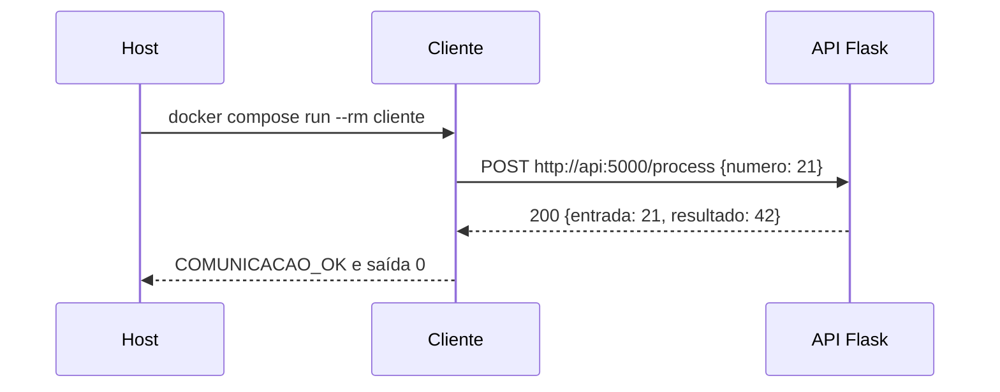

# Guia de consulta — ponderada de Docker e Compose

**Objetivo:** construir imagens, executar serviços em contêineres separados, comprovar a comunicação entre eles e explicar as decisões no README. Este guia serve como roteiro de resolução e como exemplo copiável. Adapte nomes, portas, arquivos e lógica ao enunciado recebido.

## 1. O mapa mental da atividade

Quando receber o enunciado, responda nesta ordem:

1. **Quais são os processos independentes?** Ex.: uma API que recebe dados e outro programa que a consulta. Cada processo principal vira um serviço no Compose.
2. **Quem inicia a comunicação?** Identifique origem, destino, protocolo, rota e porta. Ex.: `cliente → HTTP POST → api:5000/process`.
3. **O que cada imagem precisa?** Linguagem/base, dependências, código, diretório de trabalho e comando inicial. Isso define cada Dockerfile.
4. **O que o Compose precisa ligar?** `services`, `build`, variáveis de ambiente, rede, eventual `ports` e dependência de inicialização.
5. **Qual teste prova o requisito?** Faça uma requisição **de dentro de um contêiner para o outro**, verifique status e conteúdo da resposta e registre o resultado.
6. **Como explicar?** README com arquitetura, comandos reproduzíveis, evidência do teste, diagrama e escolhas.

> **Distinção essencial:** `localhost` dentro do contêiner `cliente` aponta para o próprio `cliente`. Para chegar à API, use o **nome do serviço** e a **porta interna**: `http://api:5000`. No computador hospedeiro, após publicar `8000:5000`, use `http://localhost:8000`.

## 2. Exemplo completo: API Flask + cliente de teste

O exemplo cria **duas imagens próprias**: `api` e `cliente`. A API recebe um número e devolve seu dobro. O cliente faz uma chamada HTTP à API, confere a resposta e termina com código de saída diferente de zero se falhar. É uma separação simples de um script único: a **regra de negócio** fica no servidor e a **entrada/teste da chamada** fica em outro processo.

```text
projeto/
├── compose.yaml
├── README.md
├── api/
│   ├── Dockerfile
│   ├── requirements.txt
│   └── app.py
└── cliente/
    ├── Dockerfile
    ├── requirements.txt
    └── client.py
```

### `api/app.py`

```python
from flask import Flask, jsonify, request

app = Flask(__name__)


@app.get("/health")
def health():
    return jsonify(status="ok")


@app.post("/process")
def process():
    payload = request.get_json(silent=True)
    if not isinstance(payload, dict) or isinstance(payload.get("numero"), bool):
        return jsonify(erro="Envie um JSON com 'numero' numérico"), 400

    numero = payload["numero"]
    if not isinstance(numero, (int, float)):
        return jsonify(erro="'numero' deve ser numérico"), 400

    return jsonify(entrada=numero, resultado=numero * 2)


if __name__ == "__main__":
    app.run(host="0.0.0.0", port=5000)
```

`0.0.0.0` faz a aplicação escutar nas interfaces do contêiner. Um servidor preso a `127.0.0.1` dentro da API não receberia chamadas vindas do `cliente`. O servidor de desenvolvimento do Flask basta para a demonstração local; em produção, use um servidor apropriado.

### `api/requirements.txt`

```text
Flask>=3.0,<4.0
```

### `api/Dockerfile`

```dockerfile
FROM python:3.12-slim
WORKDIR /app
COPY requirements.txt .
RUN pip install --no-cache-dir -r requirements.txt
COPY app.py .
EXPOSE 5000
CMD ["python", "app.py"]
```

### `cliente/client.py`

```python
import os
import requests

api_url = os.environ.get("API_URL", "http://api:5000")
resposta = requests.post(
    f"{api_url}/process", json={"numero": 21}, timeout=5
)
resposta.raise_for_status()  # erro HTTP -> teste falha
dados = resposta.json()
assert dados == {"entrada": 21, "resultado": 42}, dados
print(f"COMUNICACAO_OK: {api_url}/process -> {dados}")
```

### `cliente/requirements.txt`

```text
requests>=2.31,<3.0
```

### `cliente/Dockerfile`

```dockerfile
FROM python:3.12-slim
WORKDIR /app
COPY requirements.txt .
RUN pip install --no-cache-dir -r requirements.txt
COPY client.py .
CMD ["python", "client.py"]
```

### `compose.yaml`

```yaml
services:
  api:
    build: ./api
    ports:
      - "127.0.0.1:8000:5000"
    healthcheck:
      test: ["CMD", "python", "-c", "import urllib.request; urllib.request.urlopen('http://127.0.0.1:5000/health', timeout=2)"]
      interval: 5s
      timeout: 3s
      retries: 10

  cliente:
    build: ./cliente
    environment:
      API_URL: http://api:5000
    depends_on:
      api:
        condition: service_healthy
```

O Compose cria uma rede padrão e resolve `api` para o serviço correspondente. `depends_on` com `service_healthy` aguarda a checagem da API; só colocar `depends_on: [api]` não garante que ela já aceita requisições. A linha de `ports` libera acesso **do computador** em `localhost:8000`; o cliente usa `api:5000` pela rede interna, mesmo sem essa publicação. `EXPOSE` documenta a porta esperada da imagem; não substitui `ports`. [Documentação: rede](https://docs.docker.com/compose/how-tos/networking/) · [inicialização](https://docs.docker.com/compose/how-tos/startup-order/) · [portas](https://docs.docker.com/reference/compose-file/services/).

### Executar e comprovar

Rode na pasta `projeto/`:

```bash
docker compose version
docker compose config
docker compose build
docker compose up -d api
docker compose ps
docker compose run --rm cliente
```

**Resultado esperado do último comando:** `COMUNICACAO_OK: http://api:5000/process -> {'entrada': 21, 'resultado': 42}` e código de saída `0`. O contêiner `cliente` termina depois de testar; isso é esperado. A API continua ativa.

Teste também a interface publicada ao computador (opcional, não substitui o teste entre contêineres):

```bash
curl -i http://localhost:8000/health
curl -i -X POST http://localhost:8000/process -H 'Content-Type: application/json' -d '{"numero":21}'
```

A resposta do segundo `curl` deve conter `"resultado":42`. Se `curl` não estiver instalado, use Postman, Insomnia ou outra ferramenta HTTP no endereço `http://localhost:8000`. Para encerrar:

```bash
docker compose logs api
docker compose down
```

### Teste extra para provar que há dois serviços

Depois de `docker compose up -d api`, o comando abaixo cria um cliente temporário **na rede do Compose** e executa a chamada definida em `client.py`:

```bash
docker compose run --rm cliente
```

Se você trocar `API_URL` por `http://localhost:5000`, o teste falha: dentro do cliente, `localhost` é o próprio cliente. Se o professor pedir evidência, mostre o comando, a linha `COMUNICACAO_OK` e a configuração `API_URL: http://api:5000`.

## 3. Diagrama de sequência que você pode adaptar



**Para refazer no enunciado:** substitua `Cliente`, `API`, verbo HTTP, rota, dados e resposta pelos componentes reais. Mostre também uma seta de falha se o enunciado exigir tratamento de erro. No diagrama, o host *inicia* o contêiner; a requisição entre serviços parte do cliente e percorre a rede do Compose.

## 4. Como transformar um script único em dois contêineres

Imagine este código original:

```python
def calcular(numero):
    return numero * 2

print(calcular(21))
```

Uma separação coerente é:

| Responsabilidade original | Serviço após separação | Interface |
| --- | --- | --- |
| Executar `calcular` | `api` | `POST /process` recebe `{ "numero": 21 }` e retorna o resultado |
| Fornecer dado e consumir resultado | `cliente` | HTTP para `http://api:5000/process`; valida status e JSON |

**Raciocínio para a resposta dissertativa:** defini responsabilidades, transformei a chamada local `calcular(21)` em requisição HTTP, criei um Dockerfile para cada processo, liguei os serviços no Compose, usei `api` como nome DNS e comprovei a resposta esperada a partir do cliente. Não é necessário copiar a mesma lógica de negócio nos dois contêineres.

Se o professor entregar uma API pronta, preserve as rotas dela e adapte apenas Dockerfile, Compose e cliente de teste. Se entregar dois scripts, identifique quem produz dados e quem os consome; defina a interface entre eles antes de editar o código. Se a comunicação for por banco ou fila em vez de HTTP, o teste deve atravessar essa interface real, não apenas fazer `ping`.

## 5. Recurso certo para cada problema

| Necessidade ou sintoma | Recurso e raciocínio |
| --- | --- |
| Construir imagem de código próprio | `Dockerfile` + `build` com o contexto correto |
| Reproduzir instalação de dependências | `COPY requirements.txt` + `RUN pip install` na imagem |
| Iniciar o processo ao criar o contêiner | `CMD` no Dockerfile |
| Orquestrar processos separados | `services` no `compose.yaml` |
| Resolver endereço de outro serviço | Nome do serviço na mesma rede: `api:5000` |
| Expor API para Postman/curl no computador | `ports`, por exemplo `8000:5000` |
| A API inicia mas ainda não está pronta | `healthcheck` + `depends_on: condition: service_healthy` |
| Passar URL, senha ou configuração em execução | `environment`/variáveis de ambiente; não gravar segredos no Dockerfile |
| Guardar dados além da vida do contêiner | Volume, caso o enunciado peça persistência |
| Provar integração | Chamada real entre serviços + validação do conteúdo + saída/log |
| Descrever arquitetura e reprodução | README e diagrama de sequência |

**Imagem × contêiner:** imagem é o pacote construído; contêiner é uma execução desse pacote. **Dockerfile × Compose:** Dockerfile define como construir uma imagem; Compose define quais serviços executar e como se conectam. **Porta interna × porta do host:** em `8000:5000`, `8000` é a porta do host e `5000` é a porta do contêiner. **Rede:** os serviços no mesmo projeto Compose normalmente compartilham uma rede padrão; não é necessário declarar uma rede customizada neste exemplo. [Documentação: Compose](https://docs.docker.com/compose/gettingstarted/) · [build](https://docs.docker.com/reference/compose-file/build/).

## 6. Diagnóstico rápido durante a ponderada

| Erro | Verifique primeiro |
| --- | --- |
| `Connection refused` | API está rodando? Flask escuta em `0.0.0.0`? A porta interna é `5000`? O healthcheck passou? |
| `Name or service not known` | O nome no URL coincide com `services: api`? Ambos estão no mesmo projeto/rede Compose? |
| Cliente usa `localhost` e falha | Troque por `http://api:5000` dentro do contêiner cliente. |
| Host acessa `localhost:5000` e falha | Com `8000:5000`, o host usa `localhost:8000`. |
| API responde no host, mas cliente falha | Acesso do host testa a porta publicada; confira URL e rede **dentro** do cliente. |
| API inicia depois do cliente | Acrescente healthcheck e dependência saudável; confira `docker compose ps` e logs. |
| Alterou código, mas continua antigo | Reconstrua: `docker compose build` e recrie os serviços. |
| `COPY` não encontra arquivo | Confira o `build.context` e o caminho relativo ao contexto. |
| Cliente aparece como `Exited (0)` | Normal para tarefa de teste que termina após obter resposta. |

Comandos úteis:

```bash
docker compose config                 # valida e expande a configuração
docker compose ps                     # vê estado e saúde dos serviços
docker compose logs api               # vê erros da API
docker compose logs cliente           # vê saída do cliente iniciado por 'up'
docker compose exec api python -c "import urllib.request; print(urllib.request.urlopen('http://127.0.0.1:5000/health').read())"
docker compose down                   # encerra a aplicação
```

Não use `docker compose down -v` se houver dados em volumes que precisam ser preservados.

## 7. Modelo de README para a entrega

Crie `README.md` no repositório e **substitua os campos entre colchetes pelo que realmente fez**:

````markdown
# [Nome do projeto]

## Objetivo
[Problema resolvido em 2 ou 3 frases.]

## Serviços e responsabilidades
- `api`: [o que recebe/processa e em qual porta interna].
- `cliente`: [o que envia, quando executa e o que confere].

## Arquitetura e comunicação
`cliente` envia [método] para `http://api:[porta]/[rota]` pela rede do Compose.
O serviço `api` devolve [resposta]. O nome `api` é resolvido na rede do Compose.
[Cole ou adapte o diagrama de sequência.]

## Como executar
Pré-requisitos: Docker com Compose.
```bash
docker compose config
docker compose build
docker compose up -d api
docker compose run --rm cliente
docker compose down
```

## Teste de comunicação
- Origem: [contêiner que faz a chamada].
- Destino: [URL interna, rota e porta].
- Entrada: [payload].
- Resultado esperado: [status e conteúdo].
- Resultado obtido: [copie o trecho relevante do terminal].
- Comando executado: [comando exato].

## Decisões e aprendizados
- Usei [nome do serviço] em vez de `localhost` porque [explique com suas palavras].
- Usei [Dockerfile/Compose/healthcheck/ports] para [necessidade concreta].
- [Limitação ou próximo passo real, se houver].
````

> **Ao copiar:** use o conteúdo dentro do bloco como seu `README.md` e preencha os campos com as ações e resultados que você realmente obteve.

**Evidência forte:** um comando reproduzível, saída real do cliente, resultado esperado e explicação do caminho `cliente → api`. `ping` prova conectividade de rede, mas não prova que a rota HTTP e a lógica da aplicação funcionaram.

## 8. Checklist final de 1 minuto

- [ ] Há dois Dockerfiles e duas imagens próprias, se o enunciado pedir várias imagens.
- [ ] Cada contêiner tem um papel claro e inicia seu processo.
- [ ] `docker compose config` não aponta erro.
- [ ] O cliente usa `http://api:5000` (ou nome/porta interna equivalentes), não `localhost`.
- [ ] O backend escuta em `0.0.0.0`.
- [ ] O teste parte de um contêiner, atravessa a rede e valida uma resposta significativa.
- [ ] Guardei comando, resultado esperado e saída obtida para o README.
- [ ] Sei explicar Dockerfile, imagem, contêiner, Compose, DNS de serviço, portas e healthcheck.
- [ ] O diagrama mostra a ordem das chamadas reais.
- [ ] Consegui repetir a execução a partir dos comandos do README.

## Fontes de consulta

- [Docker: networking no Compose](https://docs.docker.com/compose/how-tos/networking/)
- [Docker: ordem de inicialização e healthcheck](https://docs.docker.com/compose/how-tos/startup-order/)
- [Docker: especificação de build no Compose](https://docs.docker.com/reference/compose-file/build/)
- [Docker: referência de serviços e portas](https://docs.docker.com/reference/compose-file/services/)
- [Docker: introdução ao Compose](https://docs.docker.com/compose/gettingstarted/)
