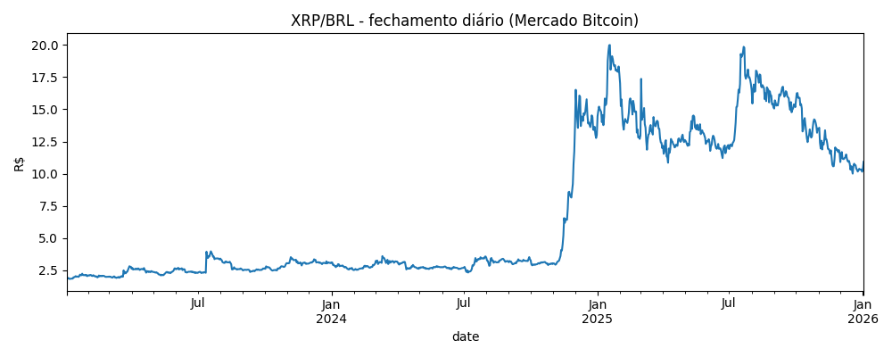
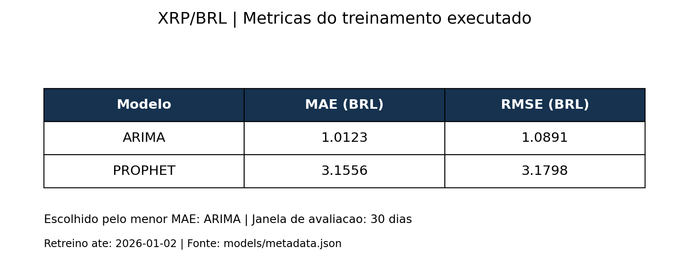
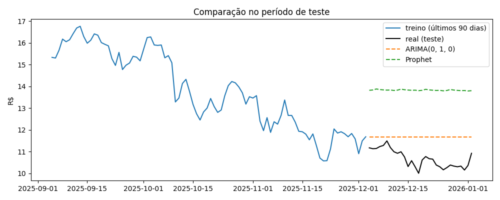
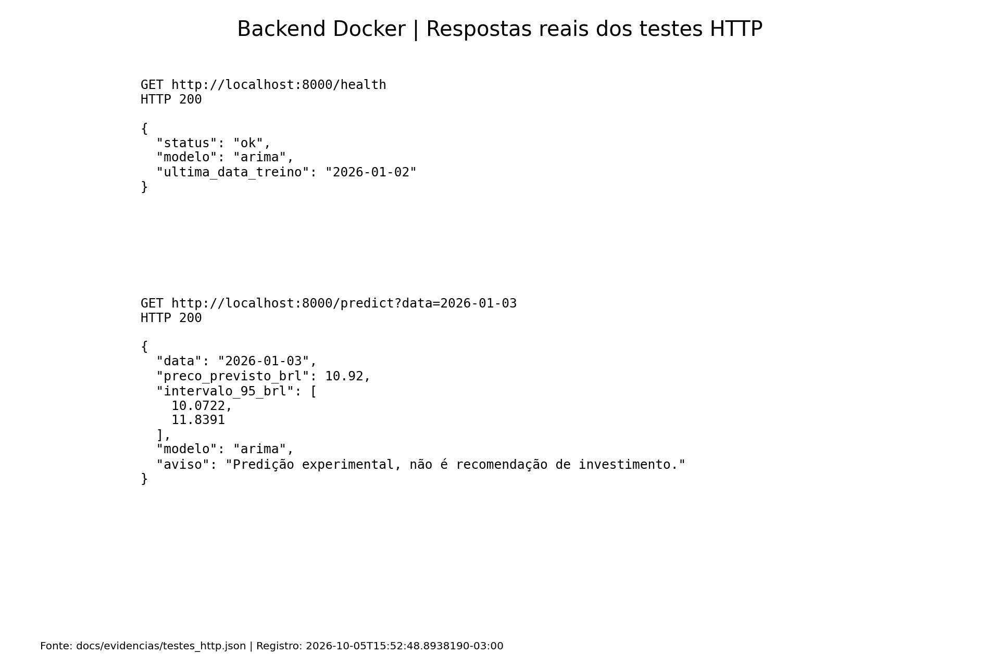

## Devlog

Escolhi o modelo ARIMAE porque estou estudando em matemática e poderia ser uma oportunidade direta de aprender.
Usei também o Propeth que é simples de usar.

### Etapa 4 — Transformar o preço e testar a estacionariedade

 No período, o XRP foi de cerca de R$ 2 para R$ 20. Com o logaritmo, uma subida de 10% vale o mesmo em qualquer faixa de preço. Além disso, ao desfazer com a exponencial, a previsão nunca sai negativa.

Teste ADF: Eu pedi alguns pontos de atenção que eu precisava ao fazer a predição com o ARIMA para o Chat GPT, e um deles era que ele precisa de uma série estacionária . O teste ADF verifica se o p-valor estiver acima de 0,05 indica que a série não é estacionária, e então precisamos fazer uma diferenciação ou mais, até ela se tornar estacionária.

Como bastou uma diferença, usei d = 1 no ARIMA.

Guardei os últimos 30 dias para testar e treinei com o resto. Não separei de forma aleatória porque isso deixaria o modelo "ver o futuro" durante o treino.

Para medir o erro usei MAE (erro médio) e o RMSE ( raiz do MSE, como é elevado ao quadrado ele pesa mais para valores maiores).

### Etapa 6 — Treinar o ARIMA

Testei todas as combinações de p e q entre 0 e 2 (9 modelos) e escolhi a de menor AIC, que equilibra o quanto o modelo se ajusta aos dados com o quanto ele é complicado.

Todos ficaram com AIC muito parecido mas o melhor foi o ARIMA(0,1,0), que esse 1 seria 1 diferenciação que comentei lá no início. Esse é o modelo mais simples possível, ele considera que a variação de um dia para o outro é imprevisível, então a melhor previsão para qualquer data futura é o último preço conhecido. 

Na primeira tentativa o Prophet errou muito e previu uma alta em dezembro de 2025 que não aconteceu. O motivo foi que ele aprendeu a grande alta que houve em novembro e dezembro de um dos anos como se fosse algo que se repete todo ano. Mas isso era fácil de se resolver, só tirando a sazonalidade. 

Mais uma demonstração do porquê usei o ARIMA. Mesmo repetindo o último preço, ele errou menos que o Prophet.

Depois retreinei o ARIMA com todos os dados, para a previsão partir do último dia disponível.

O treino salva dois arquivos na pasta `models/`:

- `arima.pkl`: o modelo treinado;
- `metadata.json`: qual modelo venceu, as métricas e a última data do treino. 

O docker-compose.yml monta a pasta models dentro do container. Escolhi volume em vez de copiar o arquivo para a imagem porque assim, se eu retreinar, é só reiniciar o container. O volume do backend é só leitura porque a API só precisa ler o modelo.

Comecei com o treino num notebook Jupyter, mas ele não executava: dava erro de `#` inesperado e apagar o caractere não resolvia. Em vez de gastar tempo nesse erro, passei o mesmo código para um script (`training/treino.py`) que roda num container Docker.

Vantagens: não precisei criar venv nem instalar bibliotecas no meu computador (o pip instala tudo durante a construção das imagens, usando os requirements.txt), e os dois containers usam o mesmo Python.

Usei FastAPI porque com poucas linhas ela cria as rotas e valida os parâmetros.

Nós temos 2 rotas, uma confirma que o serviço está no ar e qual modelo foi carregado, e o outro retorna o preço previsto em reais e o intervalo de 95%.

- Limite de 90 dias após o fim dos dados: quanto mais longe, a previsão perde o sentido.
- Intervalo de 95%: como o ARIMA(0,1,0) devolve sempre o mesmo preço, a resposta parecia um bug.

As imagens de métricas e de respostas do backend foram geradas a partir dos resultados registrados nesta execução. 

Evidências originais: [saída do treino](docs/evidencias/treinamento.txt), [respostas HTTP](docs/evidencias/testes_http.json) e [logs do backend](docs/evidencias/backend.txt).

- Limitações

- O modelo usa só o histórico de fechamento.
- A avaliação usa só uma janela de 30 dias, também usada para escolher o vencedor.
- O histórico termina em 02/01/2026. A demonstração prevê uma data posterior a esse histórico e não pro dia atual.
- A API limita o horizonte a 90 dias. No caminho alternativo do Prophet, o campo `intervalo_95_brl` precisa de ajuste, porque sua configuração usa o intervalo padrão de 80%.
