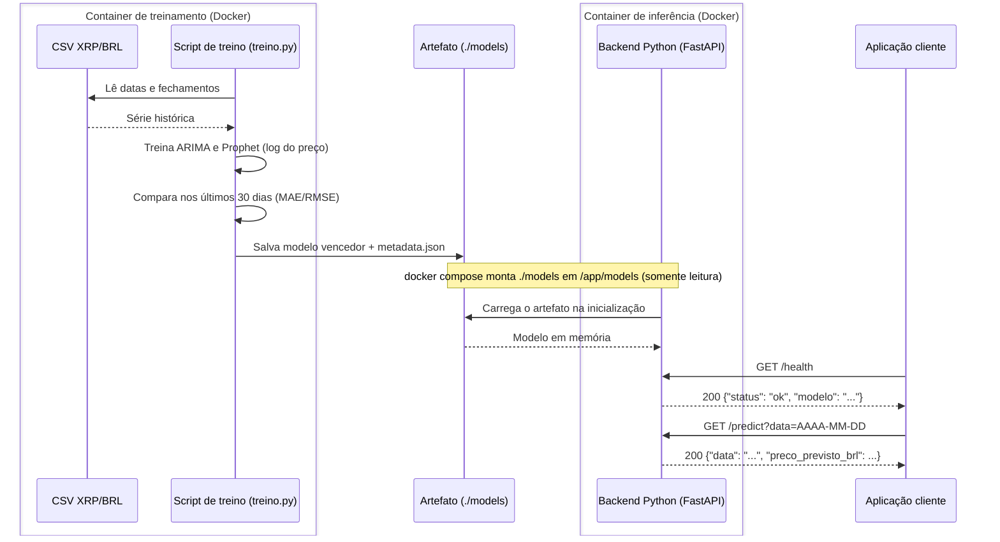

# Arquitetura

Diagrama de sequência UML com os componentes e a troca de dados. O artefato sai do container de treino para a pasta `models/` do projeto, e o `docker-compose.yml` monta essa pasta no container de inferência em `/app/models` (somente leitura). O modelo não é copiado para dentro da imagem: para trocar de modelo basta retreinar e reiniciar o container.

